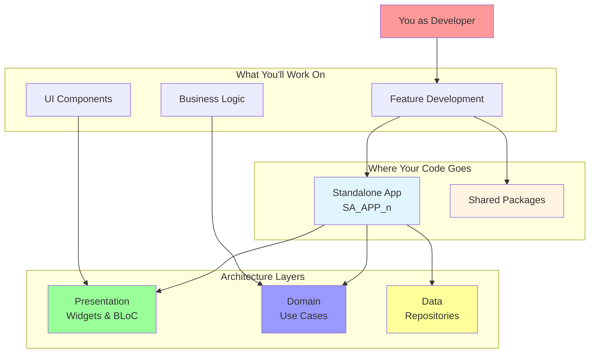
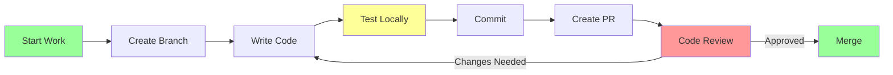
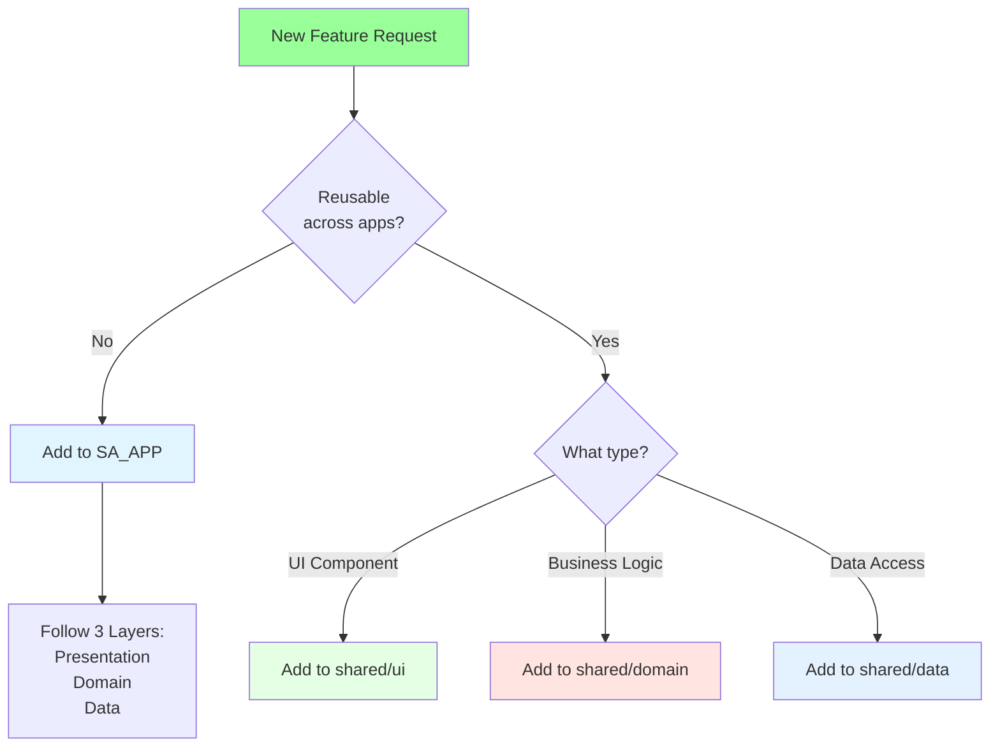
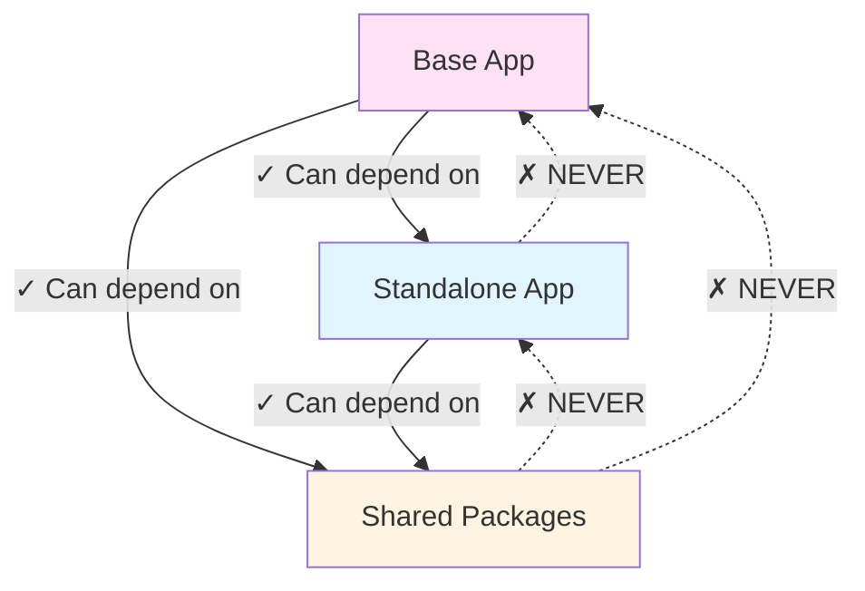
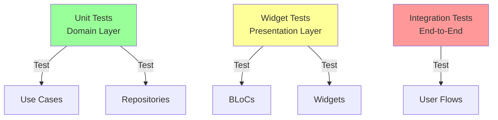
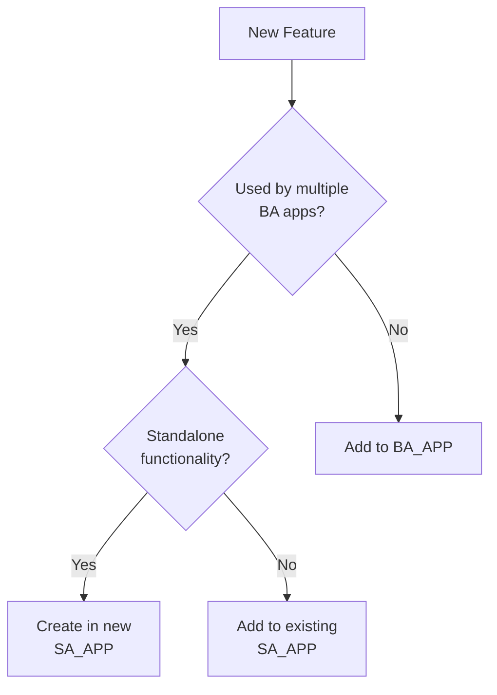
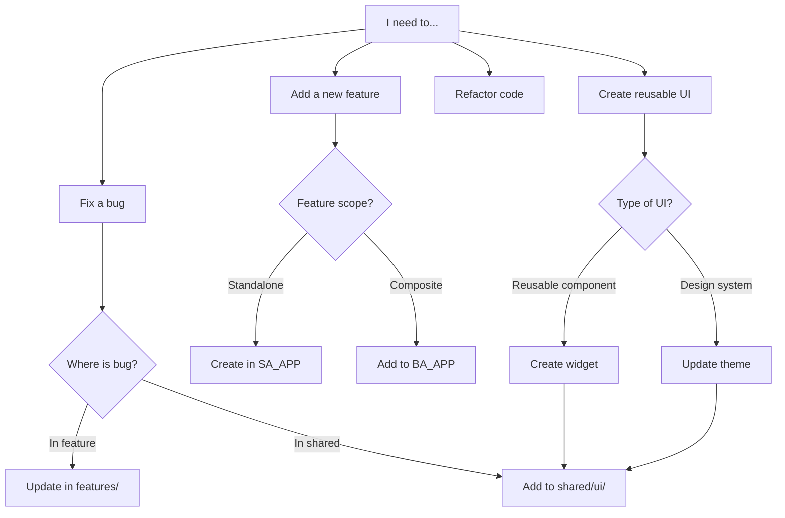

# Doctor App - Developer Onboarding Guide

Welcome to the **doctor_app** project! This guide will help you understand the architecture and start contributing quickly.

---

## 📋 Table of Contents

1. [Quick Start](#quick-start)
2. [Understanding the Architecture](#understanding-the-architecture)
3. [Project Structure](#project-structure)
4. [Development Workflow](#development-workflow)
5. [Common Tasks](#common-tasks)
6. [Best Practices](#best-practices)
7. [FAQs](#faqs)
8. [Resources](#resources)

---

## 🚀 Quick Start

### Prerequisites

Before you begin, ensure you have:

- **Flutter SDK** (latest stable version)
- **Dart SDK** (comes with Flutter)
- **Git**
- **IDE**: VS Code or Android Studio with Flutter plugins
- **Melos**: Install globally with `dart pub global activate melos`

### Initial Setup

```bash
# 1. Clone the repository
git clone <repository-url>
cd doctor_app

# 2. Bootstrap all packages
melos bootstrap

# 3. Run code generation (if needed)
melos run codegen

# 4. Run a standalone app
cd apps/SA_APP_1
flutter run
```

---

## 🏗️ Understanding the Architecture

### The Big Picture



### Three Core Concepts

#### 1. **Monorepo Structure**
All apps and shared code live in one repository. Think of it as a "mini ecosystem."

#### 2. **Standalone vs Base Apps**
- **SA Apps**: Self-contained features (like Lego blocks)
- **BA Apps**: Combine SA apps (like a Lego creation)

#### 3. **Clean Architecture**
Code is organized in three layers:
- **Presentation**: What users see
- **Domain**: Business rules and logic
- **Data**: Where data comes from

---

## 📁 Project Structure

### High-Level Overview

```
doctor_app/
│
├── apps/                    # All applications
│   ├── SA_APP_1/           # Standalone: Authentication
│   ├── SA_APP_2/           # Standalone: Patient Management
│   ├── BA_APP_1/           # Base: Doctor Dashboard
│   └── ...
│
├── shared/                  # Reusable code
│   ├── core/               # Utilities & infrastructure
│   ├── domain/             # Business entities & rules
│   ├── data/               # API clients & repositories
│   └── ui/                 # Design system & widgets
│
├── melos.yaml              # Monorepo configuration
└── README.md
```

### Inside Each App

```
SA_APP_n/
├── lib/
│   ├── main.dart                    # Entry point
│   ├── app/                         # App-level config
│   │   ├── router/                  # Navigation
│   │   └── config/                  # Configuration
│   ├── features/                    # Feature modules
│   │   └── feature_name/
│   │       ├── presentation/        # UI + BLoC
│   │       ├── domain/              # Use cases
│   │       └── data/                # Repositories
│   └── di/                          # Dependency injection
├── test/                            # Tests
└── pubspec.yaml                     # Dependencies
```

---

## 🔄 Development Workflow

### Your Daily Workflow



### Step-by-Step Process

#### 1. **Pick a Task**
- Check your project management tool (Jira, Trello, etc.)
- Understand the requirements
- Ask questions if unclear

#### 2. **Create a Feature Branch**
```bash
git checkout -b feature/your-feature-name
```

#### 3. **Determine Where to Work**

**Is it a new feature?**
- Create it in an SA app if it's standalone
- Add it to a BA app if it orchestrates multiple features

**Is it UI that will be reused?**
- Add it to `shared/ui`

**Is it business logic used everywhere?**
- Add entities to `shared/domain`
- Add repository interfaces to `shared/domain`

**Is it data access logic?**
- Add it to `shared/data`

#### 4. **Follow Clean Architecture**



#### 5. **Write Tests**
```bash
# Unit tests for domain layer
flutter test test/features/your_feature/domain

# Widget tests for presentation
flutter test test/features/your_feature/presentation

# Integration tests
flutter test integration_test
```

#### 6. **Run and Debug**
```bash
# Run specific app
cd apps/SA_APP_1
flutter run

# Hot reload works!
# Press 'r' to hot reload
# Press 'R' to hot restart
```

---

## 🛠️ Common Tasks

### Task 1: Creating a New Feature

Let's create a "Prescription" feature as an example.

#### Step 1: Set Up the Feature Structure
```bash
cd apps/SA_APP_2  # Patient Management app
mkdir -p lib/features/prescription/{presentation,domain,data}
```

#### Step 2: Create Domain Layer

**File: `lib/features/prescription/domain/entities/prescription.dart`**
```dart
class Prescription {
  final String id;
  final String patientId;
  final String doctorId;
  final List<String> medications;
  final DateTime createdAt;

  Prescription({
    required this.id,
    required this.patientId,
    required this.doctorId,
    required this.medications,
    required this.createdAt,
  });
}
```

**File: `lib/features/prescription/domain/repositories/prescription_repository.dart`**
```dart
abstract class PrescriptionRepository {
  Future<List<Prescription>> getPrescriptions(String patientId);
  Future<void> createPrescription(Prescription prescription);
}
```

**File: `lib/features/prescription/domain/usecases/get_prescriptions.dart`**
```dart
class GetPrescriptions {
  final PrescriptionRepository repository;

  GetPrescriptions(this.repository);

  Future<List<Prescription>> call(String patientId) {
    return repository.getPrescriptions(patientId);
  }
}
```

#### Step 3: Create Data Layer

**File: `lib/features/prescription/data/repositories/prescription_repository_impl.dart`**
```dart
class PrescriptionRepositoryImpl implements PrescriptionRepository {
  final PrescriptionDataSource dataSource;

  PrescriptionRepositoryImpl(this.dataSource);

  @override
  Future<List<Prescription>> getPrescriptions(String patientId) async {
    final models = await dataSource.fetchPrescriptions(patientId);
    return models.map((model) => model.toEntity()).toList();
  }

  @override
  Future<void> createPrescription(Prescription prescription) async {
    await dataSource.savePrescription(prescription);
  }
}
```

#### Step 4: Create Presentation Layer

**File: `lib/features/prescription/presentation/bloc/prescription_bloc.dart`**
```dart
class PrescriptionBloc extends Bloc<PrescriptionEvent, PrescriptionState> {
  final GetPrescriptions getPrescriptions;

  PrescriptionBloc({required this.getPrescriptions}) 
    : super(PrescriptionInitial()) {
    on<LoadPrescriptions>(_onLoadPrescriptions);
  }

  Future<void> _onLoadPrescriptions(
    LoadPrescriptions event,
    Emitter<PrescriptionState> emit,
  ) async {
    emit(PrescriptionLoading());
    try {
      final prescriptions = await getPrescriptions(event.patientId);
      emit(PrescriptionLoaded(prescriptions));
    } catch (e) {
      emit(PrescriptionError(e.toString()));
    }
  }
}
```

**File: `lib/features/prescription/presentation/pages/prescription_list_page.dart`**
```dart
class PrescriptionListPage extends StatelessWidget {
  @override
  Widget build(BuildContext context) {
    return BlocBuilder<PrescriptionBloc, PrescriptionState>(
      builder: (context, state) {
        if (state is PrescriptionLoading) {
          return CircularProgressIndicator();
        }
        if (state is PrescriptionLoaded) {
          return ListView.builder(
            itemCount: state.prescriptions.length,
            itemBuilder: (context, index) {
              final prescription = state.prescriptions[index];
              return PrescriptionCard(prescription: prescription);
            },
          );
        }
        if (state is PrescriptionError) {
          return Text('Error: ${state.message}');
        }
        return Container();
      },
    );
  }
}
```

#### Step 5: Register in DI Container

**File: `lib/di/injection_container.dart`**
```dart
// Add to your DI setup
sl.registerFactory(() => PrescriptionBloc(
  getPrescriptions: sl(),
));

sl.registerLazySingleton(() => GetPrescriptions(sl()));

sl.registerLazySingleton<PrescriptionRepository>(
  () => PrescriptionRepositoryImpl(sl()),
);

sl.registerLazySingleton<PrescriptionDataSource>(
  () => PrescriptionDataSourceImpl(sl()),
);
```

---

### Task 2: Adding a Reusable Widget

If your widget will be used across multiple apps, add it to `shared/ui`.

**File: `shared/ui/lib/widgets/custom_button.dart`**
```dart
class CustomButton extends StatelessWidget {
  final String label;
  final VoidCallback onPressed;
  final bool isLoading;

  const CustomButton({
    required this.label,
    required this.onPressed,
    this.isLoading = false,
  });

  @override
  Widget build(BuildContext context) {
    return ElevatedButton(
      onPressed: isLoading ? null : onPressed,
      child: isLoading 
        ? CircularProgressIndicator() 
        : Text(label),
    );
  }
}
```

Export it in `shared/ui/lib/ui.dart`:
```dart
export 'widgets/custom_button.dart';
```

---

### Task 3: Working with Melos

**Bootstrap all packages:**
```bash
melos bootstrap
```

**Run tests across all packages:**
```bash
melos run test
```

**Clean all packages:**
```bash
melos clean
```

**Run code generation:**
```bash
melos run codegen
```

**Version and publish packages:**
```bash
melos version
melos publish
```

---

## ✅ Best Practices

### 1. **Dependency Rules (CRITICAL)**



**Rules:**
- ✅ SA apps can use shared packages
- ✅ BA apps can use SA apps and shared packages
- ❌ Shared packages NEVER import apps
- ❌ SA apps NEVER import BA apps

### 2. **Clean Architecture Flow**

**Always follow this flow:**
```
User Action → Widget → BLoC → Use Case → Repository → Data Source → API
```

**Never do this:**
```
Widget → Repository ❌
BLoC → Data Source ❌
Widget → API ❌
```

### 3. **Code Organization Checklist**

- [ ] Is my feature in the right app? (SA vs BA)
- [ ] Are my layers properly separated? (Presentation, Domain, Data)
- [ ] Is my reusable code in `shared/`?
- [ ] Did I register dependencies in DI?
- [ ] Did I write tests?
- [ ] Did I update documentation?

### 4. **Naming Conventions**

**Files:**
- snake_case: `prescription_list_page.dart`
- Clear, descriptive names

**Classes:**
- PascalCase: `PrescriptionBloc`
- Suffixes: `Page`, `Widget`, `Bloc`, `Cubit`, `Repository`, `UseCase`

**Variables:**
- camelCase: `patientId`, `prescriptionList`

### 5. **Testing Strategy**



**Test Coverage Goals:**
- Domain Layer: 90%+
- Presentation Layer: 70%+
- Data Layer: 80%+

---

## ❓ FAQs

### Q1: Where should I put my new feature?

**Decision Tree:**



### Q2: Can I use a package from pub.dev?

**Yes!** But follow these rules:
1. Check with team lead first
2. Add it to the appropriate `pubspec.yaml`
3. Document why you need it
4. Consider adding it to `shared/core` if used everywhere

### Q3: How do I debug a specific app?

```bash
cd apps/SA_APP_1
flutter run -d <device>

# For web
flutter run -d chrome

# For desktop
flutter run -d macos  # or windows, linux
```

### Q4: My app is slow. What should I check?

1. **BLoC emitting too often?** Use `debounceTime`
2. **Building too many widgets?** Use `const` constructors
3. **Loading too much data?** Implement pagination
4. **Not disposing resources?** Check `dispose()` methods

### Q5: How do I handle errors?

**In Use Cases:**
```dart
return repository.getData().then(
  (data) => Right(data),
  onError: (error) => Left(ServerFailure()),
);
```

**In BLoCs:**
```dart
try {
  final result = await useCase();
  emit(SuccessState(result));
} catch (e) {
  emit(ErrorState(e.toString()));
}
```

**In Widgets:**
```dart
BlocBuilder<MyBloc, MyState>(
  builder: (context, state) {
    if (state is ErrorState) {
      return ErrorWidget(state.message);
    }
    // ... other states
  },
)
```

---

## 📚 Resources

### Documentation
- [Flutter Official Docs](https://flutter.dev/docs)
- [BLoC Pattern Documentation](https://bloclibrary.dev)
- [Clean Architecture Principles](https://blog.cleancoder.com/uncle-bob/2012/08/13/the-clean-architecture.html)

### Project-Specific
- **Architecture Doc**: See `doctor_app_architecture_with_diagrams.md`
- **API Documentation**: [Link to API docs]
- **Design System**: Check `shared/ui/README.md`

### Tools
- **Melos**: [Documentation](https://melos.invertase.dev/)
- **go_router**: [Documentation](https://pub.dev/packages/go_router)
- **get_it**: [Documentation](https://pub.dev/packages/get_it)

### Getting Help
- **Slack/Teams**: #doctor-app-dev channel
- **Code Reviews**: Tag @senior-dev for architecture questions
- **Weekly Sync**: Thursdays at 10 AM

---

## 🎯 Your First Week

### Day 1: Setup & Exploration
- [ ] Complete environment setup
- [ ] Run all SA apps successfully
- [ ] Explore the codebase structure
- [ ] Read architecture documentation

### Day 2: Understanding
- [ ] Pick a simple feature and trace its flow
- [ ] Understand how navigation works
- [ ] Review dependency injection setup
- [ ] Study one complete feature

### Day 3: Small Contribution
- [ ] Fix a small bug or UI issue
- [ ] Write tests for your fix
- [ ] Create your first PR
- [ ] Get familiar with code review process

### Day 4-5: Feature Work
- [ ] Pick a small feature task
- [ ] Implement following clean architecture
- [ ] Write comprehensive tests
- [ ] Document your changes

---

## 🚦 Quick Reference Commands

```bash
# Bootstrap project
melos bootstrap

# Run specific app
cd apps/SA_APP_1 && flutter run

# Run all tests
melos run test

# Generate code
melos run codegen

# Clean everything
melos clean && flutter clean

# Check for issues
flutter analyze

# Format code
dart format .

# Get dependencies
flutter pub get
```

---

## 🎉 Welcome Aboard!

You're now ready to contribute to the doctor_app project. Remember:

1. **Ask questions** – No question is too small
2. **Follow the architecture** – It's there to help you
3. **Write tests** – Future you will thank present you
4. **Collaborate** – Review others' code and ask for reviews
5. **Have fun** – Building great software is enjoyable!

**Need help?** Reach out to the team. We're here to support you! 🚀

---

## Appendix: Quick Decision Flowchart



Happy coding! 💻✨
