# Doctor App – Architecture & Design Documentation

## 1. Introduction

This document describes the **complete architecture** of the `doctor_app` system. The goal of this architecture is to support:

* Multiple **standalone Flutter applications**
* One or more **composite (base) applications** that can reuse standalone apps
* A **shared codebase** for common logic and UI
* Scalability for future apps
* Clean separation of concerns
* Testability, maintainability, and long-term evolution

This architecture is designed for **medium to large-scale Flutter systems**, especially suitable for healthcare and enterprise-grade applications.

---

## 2. High-Level Architectural Principles

The architecture is based on the following principles:

1. **Monorepo structure** – all apps live in a single repository
2. **Standalone-first design** – every app can run independently
3. **Composable applications** – some apps can embed others
4. **Clean Architecture** – strict separation of UI, business logic, and data
5. **Feature-first organization** – features are isolated and scalable
6. **Package-based reuse** – shared logic is distributed as packages
7. **Unidirectional data flow** – predictable and debuggable behavior

---

## 3. Root-Level Repository Structure

```
doctor_app/
│
├── apps/
│   ├── SA_APP_1/
│   ├── SA_APP_2/
│   ├── SA_APP_3/
│   ├── SA_APP_4/
│   ├── SA_APP_5/
│   ├── BA_APP_1/
│   └── BA_APP_2/
│
├── shared/
│   ├── core/
│   ├── domain/
│   ├── data/
│   └── ui/
│
├── melos.yaml
└── README.md
```

### Repository Structure Diagram

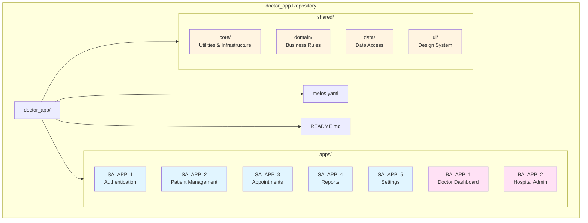

### Why a Monorepo?

* Easier dependency management
* Atomic refactoring across apps
* Shared tooling and CI/CD
* Consistent architecture across all applications

---

## 4. Application Classification

### 4.1 Standalone Applications (SA_APP_n)

**SA apps** are fully independent Flutter applications.

Characteristics:

* Can run on their own
* Have their own `main.dart`
* Can be embedded inside BA apps
* Depend only on `shared/*` packages
* Never depend on BA apps

Examples:

* SA_APP_1 – Authentication
* SA_APP_2 – Patient Management
* SA_APP_3 – Appointments
* SA_APP_4 – Reports
* SA_APP_5 – Settings

---

### 4.2 Base / Composite Applications (BA_APP_n)

**BA apps** are orchestration apps that compose multiple SA apps.

Characteristics:

* Can run independently
* Import SA apps as dependencies
* Combine features into unified flows
* Control navigation and dependency wiring

Examples:

* BA_APP_1 – Doctor Dashboard
* BA_APP_2 – Hospital Admin Console

### Application Dependency Flow

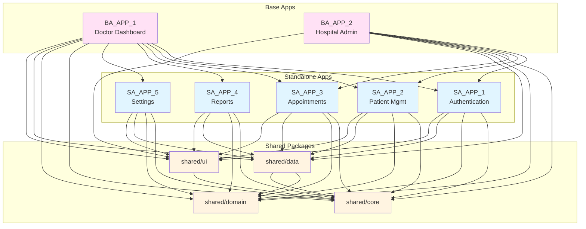

---

## 5. Shared Directory Design

The `shared/` directory contains **reusable packages**. It is not an app.

### Why Shared Is Split Into Packages

Flutter and Dart only support **dependency management at package level**.
Each reusable unit must have its own `pubspec.yaml`.

Benefits:

* Strong dependency boundaries
* Independent testing
* Controlled reuse
* Clean Architecture enforcement

---

## 6. Shared Packages Explained

### 6.1 shared/core

**Purpose:** Cross-cutting utilities and infrastructure

Contents:

* Network helpers
* Error handling
* Logging
* Constants
* Base classes

Rules:

* No Flutter UI
* No app-level dependencies

---

### 6.2 shared/domain

**Purpose:** Central business rules shared across apps

Contents:

* Entities (Doctor, Patient, Session, etc.)
* Repository contracts
* Use cases

Rules:

* Pure Dart
* No Flutter imports
* No data source implementations

Why it exists:

* Prevents duplication of business rules
* Acts as a single source of truth
* Allows consistent behavior across apps

---

### 6.3 shared/data

**Purpose:** Shared data access logic

Contents:

* API clients
* Local storage helpers
* Shared repository implementations

Rules:

* Depends on `shared/domain`
* May use Flutter plugins
* No UI code

---

### 6.4 shared/ui

**Purpose:** Design system and UI infrastructure

Contents:

* Reusable widgets
* Themes
* Responsive layout helpers
* Platform-specific UI abstractions

Rules:

* Flutter-only
* No business logic
* No app-specific navigation

### Shared Packages Internal Dependencies

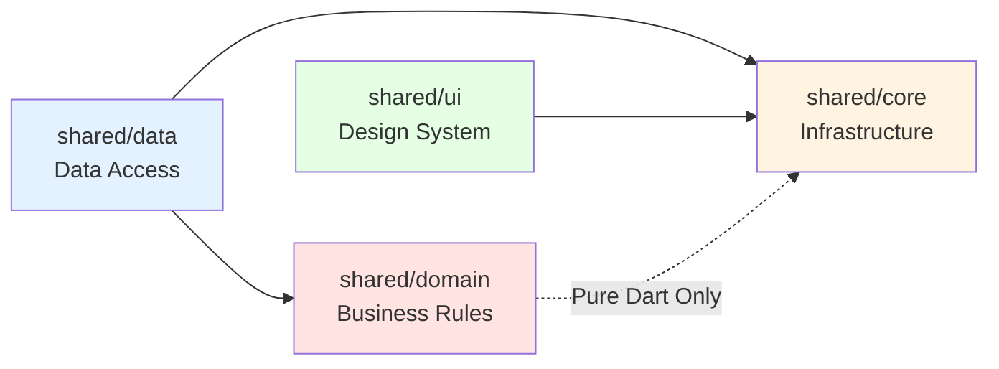

---

## 7. Architecture Inside Each App (SA & BA)

Each app follows **Feature-first Clean Architecture**.

```
lib/
├── app/
├── features/
│   └── feature_name/
│        ├── presentation/
│        ├── domain/
│        └── data/
├── di/
└── main.dart
```

### App Internal Structure

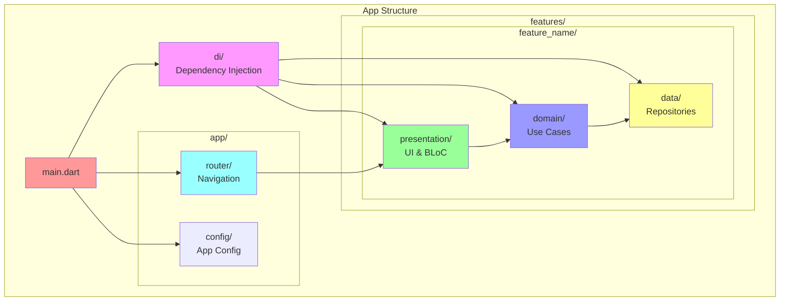

---

## 8. Clean Architecture Layers Explained

### 8.1 Presentation Layer

**Responsibilities:**

* UI widgets
* Responsive layouts
* Platform-specific UI
* Bloc / Cubit state management

Must NOT:

* Call APIs
* Access databases
* Contain business rules

---

### 8.2 Domain Layer

**Responsibilities:**

* Business rules
* Use cases
* Entities

Why this layer exists:

* Protects business logic from UI and data changes
* Centralizes decision-making
* Enables testability

Key rule:

> UI talks only to Domain, never directly to Data

---

### 8.3 Data Layer

**Responsibilities:**

* API calls
* Local storage
* Caching
* Mapping models to entities

Must NOT:

* Contain UI logic
* Decide business rules

### Clean Architecture Flow

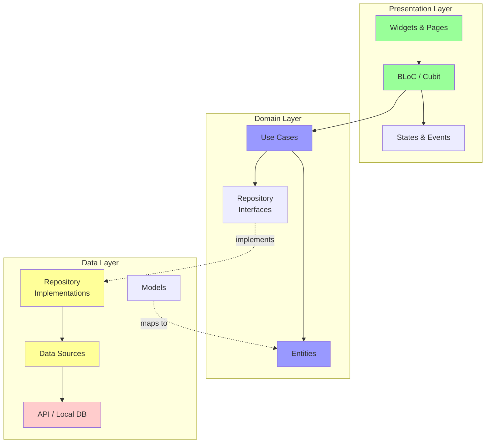

### Data Flow Diagram

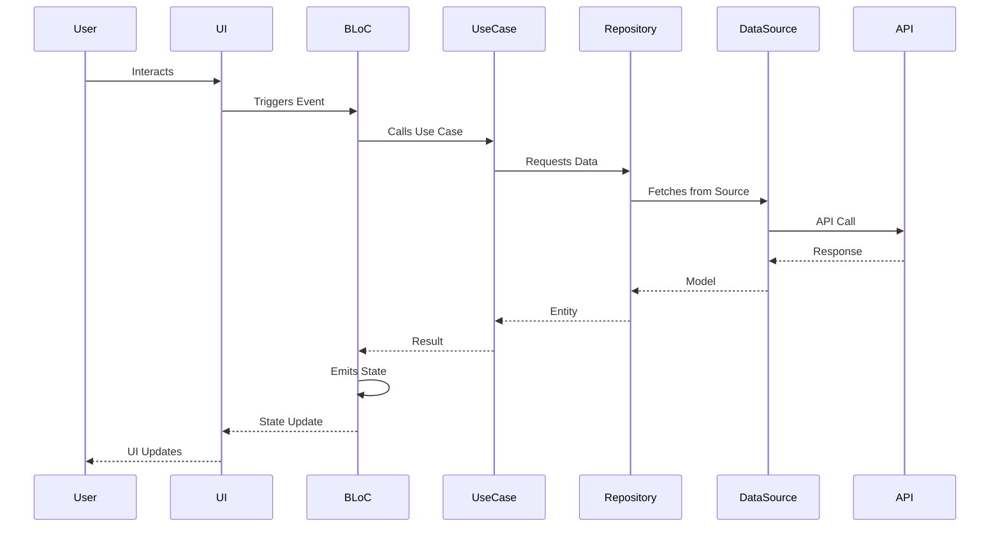

---

## 9. Responsive & Platform-Specific UI

### Where It Lives

* Implemented in `shared/ui`
* Used inside the Presentation layer

### Why Here

* UI concern only
* Reusable across apps
* Keeps domain Flutter-free

Examples:

* ResponsiveBuilder
* PlatformWidget
* Breakpoint definitions

---

## 10. Centralized Navigation (go_router)

### Where Navigation Lives

```
lib/app/router/
├── app_router.dart
├── route_names.dart
└── route_guards.dart
```

### Design Rules

* Features do not own navigation
* Apps compose routes
* SA apps expose routes optionally
* BA apps aggregate routes

### Benefits

* Predictable navigation
* Easy deep linking
* Centralized guards (auth, role-based access)

### Navigation Flow

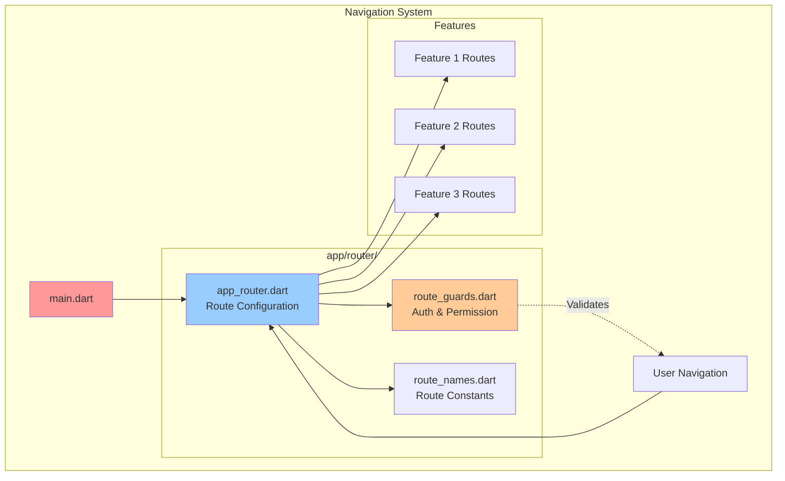

---

## 11. Dependency Injection (DI)

### Why DI Is Required

Given:

* Multiple apps
* Shared logic
* Reusable features
* Future scaling

DI provides:

* Loose coupling
* Replaceable implementations
* Easy testing
* Runtime configuration

---

### Where DI Lives

```
lib/di/
├── injection_container.dart
└── app_modules.dart
```

Each app owns its DI setup.

---

### What Gets Injected

* Blocs / Cubits
* Use cases
* Repositories
* Data sources
* Shared services (network, storage)

---

### Special Role of DI in BA Apps

* BA apps can override SA implementations
* BA apps can compose multiple repositories
* Enables orchestration without modifying SA apps

### Dependency Injection Flow

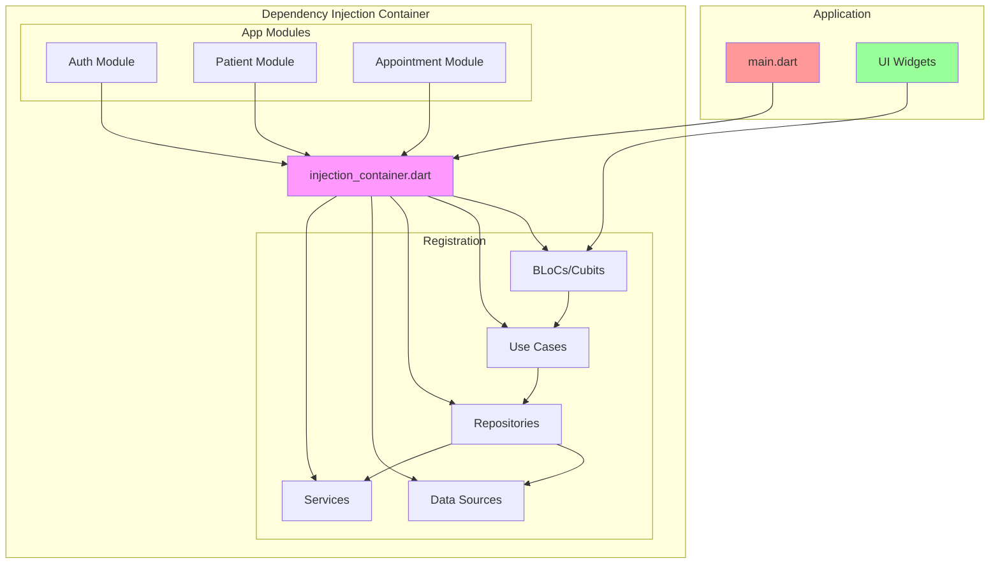

---

## 12. Dependency Rules (Critical)

```
BA_APP → SA_APP → shared
SA_APP → shared
shared → NOTHING
```

Forbidden:

* shared → app
* SA → BA
* Circular dependencies

### Dependency Rules Visualization

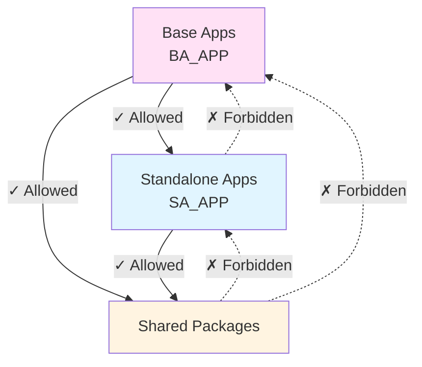

---

## 13. Scaling the System

Adding a new app:

* Create SA_APP_n
* Add dependencies to shared packages
* Optionally compose in BA apps

No refactoring required.

### System Scaling Diagram

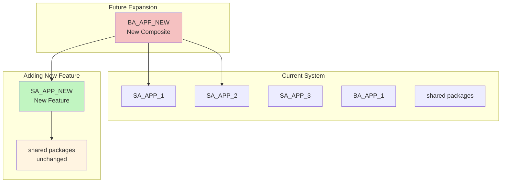

---

## 14. Key Benefits of This Architecture

* Standalone execution
* Feature reuse
* Strong boundaries
* Testability
* Offline-first readiness
* Long-term maintainability
* Enterprise-grade scalability

---

## 15. Final Summary

This architecture treats applications as **independent building blocks**, shared logic as **internal SDKs**, and base apps as **composers**.

> UI adapts, Domain decides, Data executes, DI wires, Routes compose.

This design ensures that `doctor_app` can grow in size, complexity, and team count without architectural decay.

### Complete System Overview

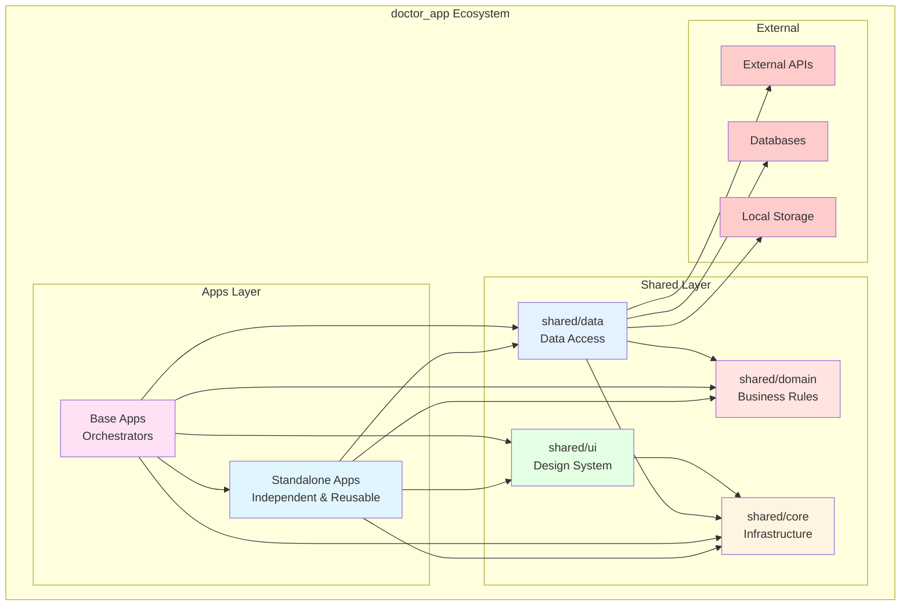
